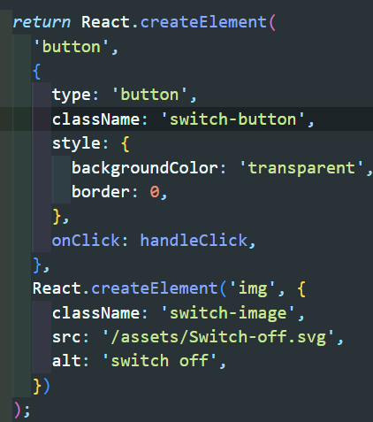
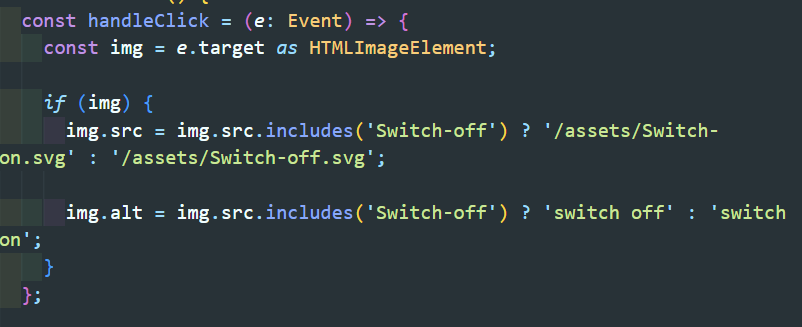
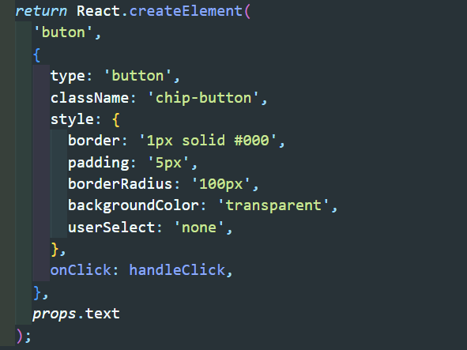
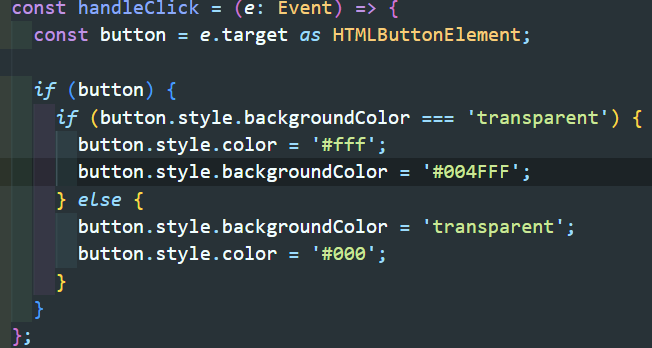
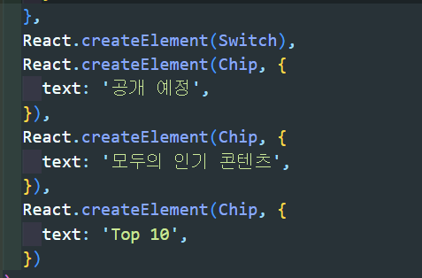
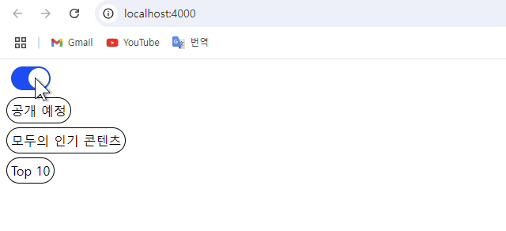

1. switch component

- button element 생성 후 기본 버튼 스타일 제거
- button element의 자식 요소로 img element 추가 -> 토글 스위치 이미지 추가

- handleClick 이벤트 함수 추가 -> img의 src와 alt 요소 확인 후 값을 변경

---

2. chip component

- button element 생성 후 스타일 추가
- props로 버튼의 text 값을 받아오도록 설정

- handleClick 이벤트 함수 추가 -> 글자 색상과 배경 색상 확인 후 변경

---

3. app component

- switch component, chip 컴포넌트를 모두 불러옴
- chip component의 props 전달

---

4. 결과

---

5. 과제를 통해 배운 점

- 과제를 통해서 react 컴포넌트 분리에 대해서 배운 내용에 대해서 복습할 수 있어서 좋았다. 특히 이벤트 함수를 연결하는 부분에서 e.target의 type을 지정하여 주어야 한다는 점을 알게 되었고 HTMLImageElement를 사용하여 타입을 지정한다는 점도 알 수 있었다. 또한, style에서 user-select를 사용하여 버튼의 글자 요소가 선택되지 않도록 할 수 있다는 점을 새롭게 알게 되었다.

---

6. 어려운 점/아쉬운 점

- 어려웠던 점은 각 요소의 type을 신경써서 코드를 작성해야 하는 점이다. typescript가 아직 많이 익숙해지지 않은 것 같아 연습을 많이 해야 할 것 같다.
